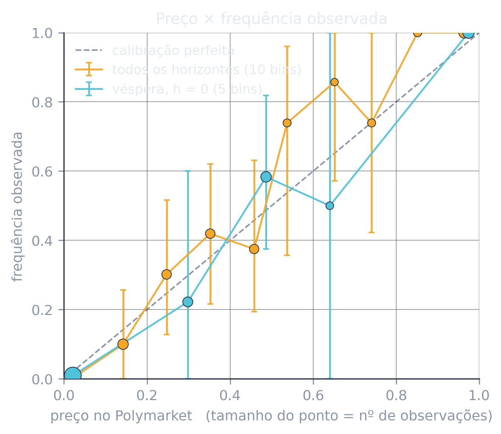
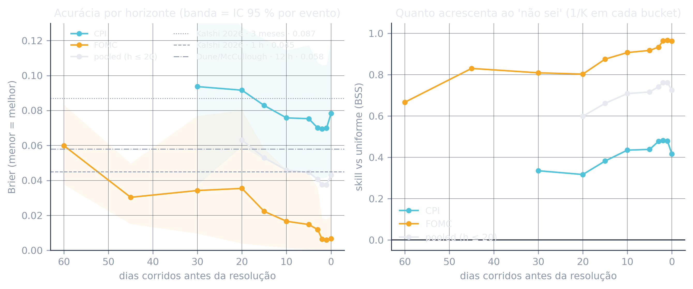
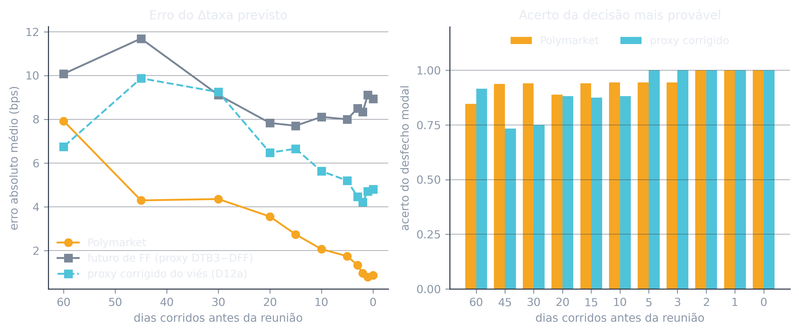
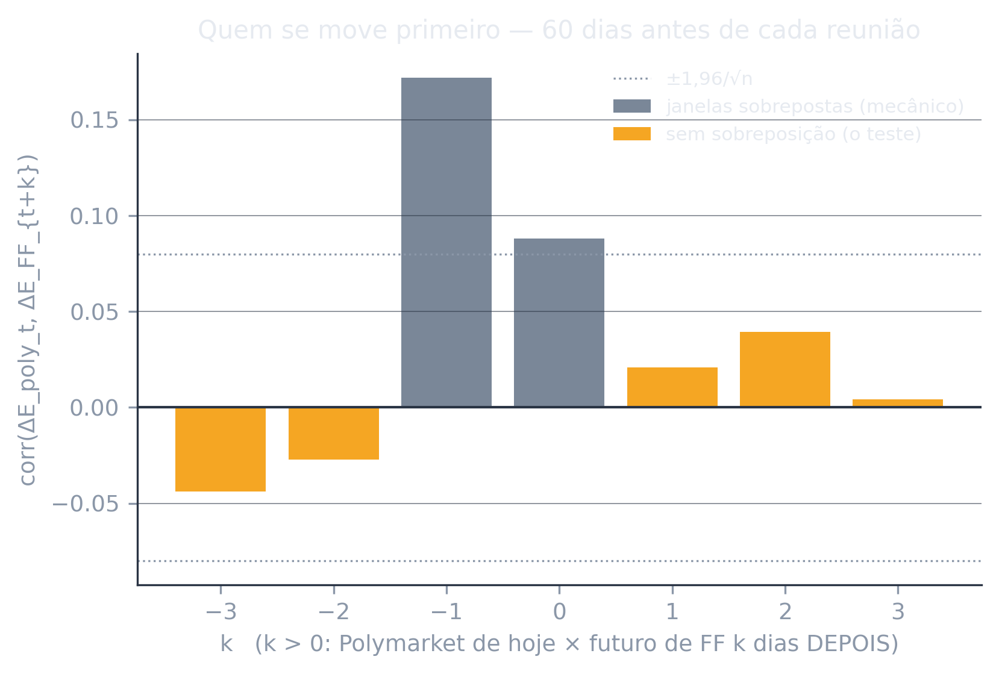
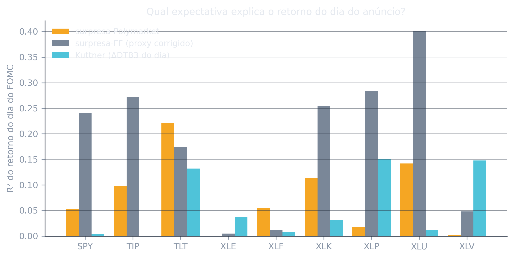
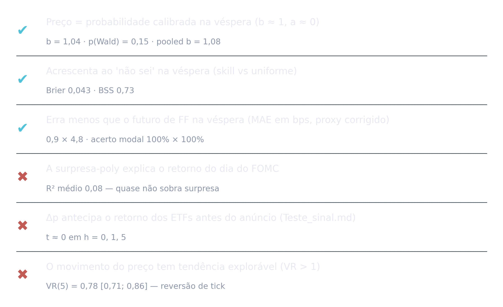

# O Polymarket como fonte de sinal: calibração, valor informacional e aplicabilidade a uma carteira de ETFs

**Equipe KAIROS · Itaú Quant AI Challenge · final 2026** · versão de 2026-09-17

> Gerado a partir de `scripts/estudo_polymarket.py`; todos os números vêm de
> `Uteis/analises/Metricas_estudo.md` e dos CSV em `Uteis/dados/estudo/`. Nada é
> digitado à mão. **O estudo mede; não decide** — nenhum parâmetro da estratégia
> muda por causa dele.

## 1. Resumo

Testamos, com o mesmo dado que alimenta a estratégia, se o preço de um contrato
do Polymarket é uma probabilidade utilizável — e onde exatamente está o seu
valor. A amostra são **150 contratos binários** (76 desfechos de 18 reuniões do
FOMC e 74 faixas de 12 divulgações mensais de CPI), lidos em **11 horizontes**
até a resolução (0 a 60 dias), com resolução observada em fonte externa (FRED),
totalizando 1.416 observações (contrato × horizonte).

Três respostas:

1. **O preço é calibrado.** Na véspera, Brier pooled = **0,043** (IC 95 %
   [0,022; 0,067]) — a mesma faixa que o Kalshi reporta a 1 h da resolução
   (0,045) e melhor que o Dune/McCullough a 12 h (0,058). A regressão
   `frequência = a + b·preço` dá `b = 1,04` (EP 0,03) e não rejeita calibração
   perfeita (p = 0,15). Descontado o "não sei", o skill é de **73 %** na véspera
   e ainda **60 %** a 20 dias. O único desvio sistemático é o viés
   favorito-azarão clássico: contratos abaixo de 10 ¢ (média 1,9 ¢) **nunca**
   resolveram Yes em 908 observações.
2. **No FOMC, o Polymarket erra menos que o mercado de juros.** O Δtaxa esperado
   pelo Polymarket na véspera erra **0,9 bps** em média, contra 8,9 bps do proxy
   do futuro de fed funds (`DTB3 − DFF`) e 4,8 bps do mesmo proxy corrigido do
   viés (Diebold–Mariano p < 0,01 nos dois casos). Acerta o desfecho modal em
   **100 %** das reuniões até 2 dias antes e 89 % a 20 dias. Na regressão de
   *encompassing*, o coeficiente do Polymarket é 1,14 (t = 19) e o do futuro é
   −0,06 (t = −1): o futuro não acrescenta nada ao Polymarket.
3. **O valor está no nível, não no movimento.** (a) A surpresa que sobra na
   véspera é tão pequena que quase não explica o retorno dos ETFs no dia do
   anúncio (R² médio 0,08); (b) Δp não antecipa o retorno dos ETFs antes do
   anúncio (`Teste_sinal.md`: t ≈ 0); (c) o próprio preço do Polymarket não tem
   tendência explorável — VR(5) = 0,78 no FOMC, 0,43 nos payrolls, i.e., reversão
   de ruído de tick, não momentum. É por isso que a estratégia usa o nível via
   Black-Litterman (β × surpresa) e não negocia o movimento da probabilidade.

## 2. Motivação e literatura

Os dois estudos públicos de calibração de mercados de previsão são amplos e
externos: o **Kalshi Research (2026)** mede 2 milhões de mercados e reporta
Brier de 0,087 a 3 meses caindo a 0,045 a 1 h; o painel **Dune/McCullough** do
Polymarket reporta ~0,084 no agregado e 0,058 a 12 h, com ~90 % de acerto a um
mês. A crítica a ambos (DL News) é a seleção: o estudo do Kalshi exclui ~80 %
dos mercados (esportes, menções, intradiários). Nosso estudo é o oposto em
escopo — só macro dos EUA — mas com três coisas que os estudos amplos não têm:
(i) a **amostra é 100 % declarada** (todos os mercados que o pipeline puxou
para as views, sem exclusão posterior); (ii) há um **benchmark de mercado
tradicional para o mesmo objeto** — o futuro de fed funds para a decisão do
FOMC —, no espírito de Diercks, Katz & Wright (FEDS 2026, *Kalshi and the Rise of
Macro Markets*), que acham o Kalshi melhor que o futuro de FF e equivalente ao
SPF; (iii) a ligação com o **preço dos ativos** que a estratégia negocia.

A metodologia é a padrão de avaliação de previsões probabilísticas: Brier
(1950) e sua decomposição de Murphy (1973); regressão de calibração
(Mincer–Zarnowitz); *ranked probability score* para distribuições (Epstein
1969; Gneiting & Raftery 2007); Diebold–Mariano (1995) com a correção de
Harvey–Leybourne–Newbold; *encompassing* de Fair–Shiller (1990); teste de razão
de variâncias de Lo–MacKinlay (1988). O viés favorito-azarão em mercados de
previsão é o de Wolfers & Zitzewitz (2004, 2006) e Page & Clemen (2013), que
mostram calibração pior longe da resolução. O *event-study* do dia do anúncio
segue Kuttner (2001) e Bernanke & Kuttner (2005); a ressalva sobre prêmio a termo
no futuro de FF é de Piazzesi & Swanson (2008).

## 3. Dados e amostra

Tudo vem do dado congelado em `data/` (pipeline do Paulo, Decisão 2: Gamma + CLOB
`/prices-history`, grade de 12 h). Um achado de dado que muda o desenho: **a
série de todo mercado termina no slot das 12:00 UTC do dia do anúncio**, antes
do evento (14:00 ET no FOMC; 08:30 ET no CPI). O último preço ainda é
expectativa — a resolução tem de vir de fora.

| família | mercados | eventos | resolução (y) | período |
|---|---|---|---|---|
| FOMC — PMF da decisão por reunião | 76 faixas (corte/alta de 25/50/75 bps, sem mudança) | 18 reuniões | Δ da taxa efetiva (`DFF`) ao redor da reunião, arredondado a 25 bps | mai/2024 – jun/2026 |
| CPI — PMF da variação mensal | 74 faixas (0,1 p.p. cada; pontas abertas) | 12 divulgações | MoM do `CPIAUCSL` arredondado a 1 casa, como o BLS publica | mar/2025 – jul/2026 |
| Payrolls — PMF de NFP e desemprego | 176 faixas | 27 mercados | **sem y** (arquivos sem rótulo de faixa; `PAYEMS`/`UNRATE` não estão no repo) | nov/2024 – ago/2026 |

Payrolls entram só onde não é preciso resolver (Σp e martingale). O CPI de
out/2025 nunca foi publicado (shutdown) e o de nov/2025 não tem MoM
computável; o de jul/2026 ainda não tinha sido publicado no dado — ficam fora
por construção, não por escolha.

**Unidade de observação:** (contrato, h), com o preço lido no slot pré-abertura
(12:00 UTC — a mesma regra de alinhamento da estratégia) do dia `resolução − h`,
h ∈ {0, 1, 2, 3, 5, 10, 15, 20, 30, 45, 60} dias corridos. Sem leitura no slot,
a observação não existe (a reunião de 29/10/2025 não tem o slot da véspera; os
mercados de CPI vivem ~30 dias, então somem além de h = 20). As faixas de uma
mesma PMF são dependentes por construção (somam ~1): **todo intervalo de
confiança é bootstrap por evento (B = 2.000) e todo erro-padrão é
cluster-robusto por evento.**

Cobertura (eventos com leitura por h): FOMC 17–18 até h = 30, 16 em h = 45, 13
em h = 60; CPI 12 até h = 20, 5 em h = 30, 0 depois. Detalhe em
`Uteis/dados/estudo/cobertura_h.csv`.

## 4. Método

**Q1 — calibração.** Brier por família e horizonte, com skill score contra a
PMF uniforme sobre as faixas vivas (BSS = 1 − Brier/Brier_uniforme — a base-rate
1/K muda com a grade, e "chutar igual em tudo" é o "não sei" honesto).
Decomposição de Murphy (confiabilidade − resolução + incerteza). Curva de
calibração (10 bins no pooled, 5 por recorte) e regressão `y = a + b·p` com
Wald de (a, b) = (0, 1). Viés favorito-azarão pelos bins extremos e pelo γ da
correção `p^γ/(p^γ + (1−p)^γ)` que minimiza o Brier (só medido; a D9 fixa
γ = 1,0). RPS da PMF contra uniforme e persistência (massa na faixa do evento
anterior). Σp da PMF (overround). Brier por tercil de volume (FOMC).

**Q2 — valor vs. mercado tradicional (FOMC).** `E_poly[Δ]` = média da PMF
(ponta aberta a meia largura para fora, D1.2); `E_FF` = `DTB3 − DFF` em bps, o
proxy que a estratégia usa sem o contrato ZQ (D12), lido no último fechamento
anterior à leitura do Polymarket. Como o proxy tem horizonte de ~3 meses contra
uma reunião, tem viés de nível; a estratégia o corrige pela média expansiva dos
erros passados (D12a) e o estudo faz o mesmo (`E_FF corrigido`, só com
reuniões anteriores). Por horizonte: MAE, RMSE, acerto do desfecho modal,
Diebold–Mariano sobre |erro|. *Encompassing*: `Δreal = a + b₁E_poly + b₂E_FF`.
Lead-lag: correlação cruzada e regressões de Granger com EP de Newey–West entre
ΔE_poly (pré-abertura) e ΔE_FF (fechamento) nos 60 dias úteis antes de cada
reunião — respeitando que Δpoly_t cobre [08:00 ET de t−1, 08:00 ET de t] e
Δff_t cobre [16:00 ET de t−1, 16:00 ET de t]: as janelas só se cruzam em
k ∈ {−1, 0}; os lags k = +1 e k = −2 são o teste limpo.

**Q3 — aplicabilidade.** *Event-study* do dia do anúncio: `r_i(D) = α + β·s`
para os 9 ETFs, com `s` ∈ {surpresa-Polymarket = realizado − E_poly(véspera);
surpresa-FF corrigida; Kuttner = ΔDTB3 do dia}. Pré-anúncio: transcrito de
`Uteis/analises/Teste_sinal.md` (não re-rodado). Martingale do preço cru em
slots de 12 h: autocorrelação de Δp e razão de variâncias VR(2), VR(5), pooled
por família, com coluna de robustez só em preços "interiores" (2 ¢ < p < 98 ¢).

## 5. Resultados

### 5.1 Q1 — o preço é uma probabilidade calibrada, e a acurácia cresce até o evento

| recorte | n | Brier | IC 95 % | Brier uniforme | **BSS** | log-loss |
|---|---|---|---|---|---|---|
| pooled, h = 0 | 146 | **0,043** | [0,022; 0,067] | 0,157 | **0,73** | 0,134 |
| pooled, h = 1 | 150 | 0,038 | [0,021; 0,058] | 0,158 | 0,76 | 0,122 |
| pooled, h = 20 | 150 | 0,063 | [0,037; 0,090] | 0,158 | 0,60 | 0,199 |
| FOMC, h = 0 | 72 | 0,007 | [0,000; 0,020] | 0,180 | 0,96 | 0,030 |
| FOMC, h = 20 | 76 | 0,035 | [0,004; 0,080] | 0,180 | 0,80 | 0,117 |
| CPI, h = 0 | 74 | 0,078 | [0,045; 0,120] | 0,134 | 0,42 | 0,236 |
| CPI, h = 20 | 74 | 0,092 | [0,059; 0,127] | 0,134 | 0,32 | 0,283 |

- **Nível.** Na véspera o Brier pooled (0,043) está na faixa do Kalshi a 1 h
  (0,045) e abaixo do Dune a 12 h (0,058). O FOMC é quase determinístico na
  véspera (0,007); o CPI é o objeto difícil (0,078) — e mesmo assim tem 42 % de
  skill sobre o "não sei". A linha pooled só vale até h = 20: além disso a
  amostra vira só FOMC e o Brier cai por composição, não por acurácia.
- **Horizonte.** A acurácia melhora monotonicamente do dia 20 para a véspera
  nas duas famílias (FOMC 0,035 → 0,007; CPI 0,092 → 0,078) — o padrão de
  Page & Clemen (2013) e do Kalshi. A 60 dias o FOMC ainda tem BSS de 0,67.
- **Calibração.** Decomposição de Murphy no pooled: confiabilidade **0,003**,
  resolução 0,119, incerteza 0,162 — o Brier é quase todo incerteza
  irredutível menos resolução; o termo de descalibração é 6 % do total.
  Regressão `y = a + b·p`: na véspera `b = 1,04 (0,03)`, `a = −0,01 (0,01)`,
  Wald p = 0,15; a 20 dias `b = 1,04`, p = 0,27. No pooled (n = 1.416) o
  desvio fica detectável — `b = 1,08 (0,03)`, `a = −0,02`, p < 0,001 — e tem
  um sentido só: **frequências mais extremas que os preços**, o viés
  favorito-azarão. Nos extremos: contratos com p < 0,10 (média 0,019; n = 908)
  resolveram Yes **0,0 %** das vezes; com p > 0,90 (média 0,964; n = 138),
  **100 %**. O γ que minimiza o Brier é 1,20 no pooled (1,10 na véspera; 1,45
  no FOMC; 1,10 no CPI) — exatamente a faixa {1,1; 1,25} que a D9 já usa como
  robustez; a estratégia segue com γ = 1,0 e este número fica como medida.
- **A distribuição inteira, não só a faixa.** RPS na véspera: FOMC **0,005**
  contra 0,132 da uniforme e 0,115 da persistência ("repete a última
  decisão"); CPI **0,058** contra 0,169 e 0,291 — repetir o mês anterior é
  *pior* que chutar uniforme no CPI, e o Polymarket é 3× melhor que ambos.
- **Coerência do livro.** Σp das faixas do FOMC = 1,003 (dp 0,004) na véspera
  — praticamente sem overround. No CPI a véspera é mais suja (média 1,04, de
  0,75 a 1,45), mas de 1 a 5 dias antes Σp = 1,00 (dp ≤ 0,05). É o ingrediente
  da régua do Ω (Lia), medido aqui na população inteira.
- **Volume.** Nos 76 contratos do FOMC, o Brier cai de 0,041 no tercil de
  menor volume (mediana US$ 5 mi) para 0,010 e 0,012 nos tercis médio e alto
  (US$ 24 mi e US$ 67 mi) — direção do achado do Dune, com a ressalva de que
  volume e certeza são endógenos (o dinheiro vai ao desfecho provável).

### 5.2 Q2 — no FOMC, o Polymarket erra menos que o mercado de juros

| h (dias) | n | MAE Polymarket | MAE futuro FF (cru) | MAE futuro FF (corrigido) | acerto modal Poly | acerto modal FF corr. | DM p (vs cru) | DM p (vs corr.) |
|---|---|---|---|---|---|---|---|---|
| 0 | 17 | **0,9** | 8,9 | 4,8 | **100 %** | 100 % | < 0,001 | 0,002 |
| 1 | 18 | 0,8 | 9,1 | 4,7 | 100 % | 100 % | < 0,001 | 0,001 |
| 5 | 18 | 1,7 | 8,0 | 5,2 | 94 % | 100 % | 0,001 | 0,001 |
| 10 | 18 | 2,1 | 8,1 | 5,6 | 94 % | 88 % | < 0,001 | 0,003 |
| 20 | 18 | **3,6** | 7,8 | 6,5 | **89 %** | 88 % | 0,002 | 0,003 |
| 30 | 17 | 4,4 | 9,1 | 9,2 | 94 % | 75 % | < 0,001 | 0,002 |
| 60 | 13 | 7,9 | 10,1 | 6,8 | 85 % | 92 % | 0,13 | 0,76 |

- **Magnitude.** Na véspera o Polymarket erra 0,9 bps o Δtaxa; o proxy cru
  erra 8,9 (viés de +8,8 bps: o T-bill de 3 meses embute mais de uma reunião e
  prêmio a termo — Piazzesi & Swanson 2008) e o proxy corrigido 4,8. O
  Diebold–Mariano rejeita igualdade em todo h ≤ 30 (n = 17–18; potência baixa,
  mas a diferença é grande). A 60 dias a vantagem some (p = 0,76): o Polymarket
  distingue-se **perto do evento**, quando o mercado de juros ainda carrega
  ruído de nível.
- **Decisão.** O desfecho modal do Polymarket acertou 17 de 17 reuniões na
  véspera (inclui set/2024, o 50 × 25 que estava em 52 % contra 47 %). O proxy
  corrigido também acerta tudo perto do evento — a decisão do Fed raramente
  surpreende alguém na véspera. A diferença é a **distribuição**: RPS 0,005 vs
  o que um ponto ± ruído consegue.
- **Encompassing.** `Δreal = a + 1,14·E_poly − 0,06·E_FF` na véspera (t = 19,0
  e −1,05); a 20 dias `1,75·E_poly − 0,49·E_FF` (t = 4,9 e −1,2). O futuro de
  FF não acrescenta informação ao Polymarket; o inverso não vale.
- **Quem se move primeiro.** Correlação de ΔE_poly com ΔE_FF: 0,17 em k = −1 e
  0,09 em k = 0 (as duas janelas que se sobrepõem no relógio: o Polymarket das
  08:00 ET já contém o pregão de ontem); nos lags sem sobreposição, **0,02 em
  k = +1 e −0,03 em k = −2** (n ≈ 620; banda ±0,08). Nas regressões de Granger,
  o Δpoly de hoje entra no Δff de hoje com t = 1,8 e o Δff de ontem entra no
  Δpoly de hoje com t = 1,9 — nada limpo nos dois sentidos. **A informação
  chega aos dois mercados no mesmo pregão; nenhum lidera em dias.** O valor do
  Polymarket não é antecipar o futuro de FF; é dar a distribuição da decisão
  com menos ruído.

### 5.3 Q3 — o valor está no nível; o movimento não é sinal

**(a) O dia do anúncio.** Com 17 reuniões, a surpresa-Polymarket explica pouco
do retorno do dia (R² médio nos 9 ETFs = 0,08; só TLT chega a 0,22, t = 2,1).
A surpresa-FF corrigida explica mais (R² médio 0,19; XLU 0,40, XLP 0,28, TIP
0,27, SPY 0,24, todos com t > 2), e a surpresa de Kuttner (ΔDTB3 do dia) 0,06.
A leitura não é que o Polymarket "explica pior": é que **na véspera quase não
sobra surpresa a explicar** (MAE 0,9 bps, RMSE 1,7). O que move os ETFs no
dia do FOMC é o caminho da política (comunicado, projeções, coletiva), que o
T-bill de 3 meses carrega em parte e um contrato sobre a decisão de uma
reunião não carrega. No CPI (12 divulgações) nenhuma das duas surpresas explica
nada (R² médio 0,03 e 0,01; nenhum |t| > 1,2). É a mesma razão pela qual a view 2.3 gera tilts pequenos: o
β é bem estimado (event-study de Kuttner), mas o insumo `surpresa` é pequeno.

**(b) Antes do anúncio (negativo, já medido).** De `Uteis/analises/Teste_sinal.md`
— regressão de `r_P(D → D+h)` contra o próprio Q(D) da view:

| view | n | h = 0 | h = 1 | h = 5 |
|---|---|---|---|---|
| 2.2 inflação | 274 | t = +0,29 · acerto 50 % | t = +0,57 · 53 % | t = +0,85 · 50 % |
| 2.3 Fed | 325 | t = +0,59 · 50 % | t = +0,26 · 51 % | t = +0,23 · 56 % |

E a conclusão da seção 1 de `Conclusoes.md`: *"o sinal tem tamanho; ele
simplesmente não antecipa o retorno dos ativos"* — no livro direcional. A
camada tática só saiu do zero no livro **neutro** (`+XLP −XLK`, D28).

**(c) O preço do Polymarket é (quase) um martingale.**

| família | séries | n Δp | ACF(1) [IC] | VR(2) [IC] | VR(5) [IC] | VR(5) só interior |
|---|---|---|---|---|---|---|
| FOMC | 76 | 8.216 | −0,13 [−0,18; −0,09] | 0,87 [0,82; 0,91] | **0,78** [0,71; 0,86] | 0,79 [0,72; 0,87] |
| CPI | 74 | 2.266 | 0,00 [−0,10; 0,08] | 0,83 [0,72; 0,95] | 0,72 [0,50; 0,97] | 0,83 [0,59; 1,13] |
| Payrolls | 176 | 10.326 | −0,17 [−0,20; −0,12] | 0,71 [0,67; 0,75] | **0,43** [0,38; 0,48] | 0,43 [0,38; 0,48] |

Autocorrelação **negativa** em 12 h e VR < 1: o preço reverte no curto prazo —
ruído de tick e de livro, o mesmo "ruído de discretização" que a D17 achou ao
tentar operar Δp de um dia para o outro, e a reversão no último slot que a
`Cristalizacao_entropia.md` mediu. Não há tendência (VR > 1) em família
nenhuma. **O movimento da probabilidade não é sinal; o nível é.**

## 6. Limitações

- **Só macro dos EUA, dois anos.** 18 reuniões e 12 CPIs no ciclo de cortes de
  2024–26: potência baixa nos testes de reunião (DM, encompassing, event-study)
  e sem generalização para eleições, geopolítica ou esportes.
- **Payrolls sem resolução.** Os arquivos vieram sem rótulo de faixa e o repo
  não tem `PAYEMS`/`UNRATE`; entram só em Σp e martingale. Com o dado, entram
  na Q1 pelo mesmo script.
- **O benchmark é um proxy.** `DTB3 − DFF` não é o contrato ZQ (fonte paga,
  D12); tem horizonte de 3 meses e prêmio a termo. A correção pela média
  expansiva dos erros (D12a) reduz o viés, mas a comparação "Polymarket ×
  futuro de FF" é, a rigor, "Polymarket × T-bill".
- **Grade de 12 h e um slot fixo.** A leitura é a das 12:00 UTC; o lead-lag em
  dias não vê quem se move primeiro dentro do pregão.
- **Dependência.** Observações (contrato, h) do mesmo evento são dependentes;
  tudo é clusterizado por evento, mas 30 clusters é pouco para a cauda do
  bootstrap.
- **Seleção.** A amostra são os mercados que o pipeline puxou para as views —
  mercados de decisão do FOMC e de CPI mensal, os mais líquidos da categoria.
  Não há exclusão posterior, mas também não há mercado ilíquido de nicho.

## 7. Conclusão

O Polymarket entrega, no dado macro que a estratégia consome, exatamente o
que uma view de Black-Litterman precisa: **uma probabilidade calibrada**
(Brier 0,043 na véspera, `b ≈ 1`), **melhor que o mercado de juros no objeto
que os dois precificam** (0,9 vs 4,8 bps; o futuro não acrescenta nada em
encompassing) e **sem tendência própria a ser negociada** (VR < 1, Δp não
antecipa retorno). O único viés — favorito-azarão, γ ≈ 1,1–1,2 — já está na
varredura de robustez da D9. Daí o desenho do KAIROS: o nível do Polymarket
entra como opinião (Q = β × surpresa), a estabilidade da distribuição entra
como confiança (Ω), e o movimento da probabilidade não entra como sinal.

## Referências

- Bernanke, B. & Kuttner, K. (2005). What explains the stock market's reaction to Federal Reserve policy? *Journal of Finance* 60(3).
- Brier, G. (1950). Verification of forecasts expressed in terms of probability. *Monthly Weather Review* 78.
- Diebold, F. & Mariano, R. (1995). Comparing predictive accuracy. *JBES* 13(3); Harvey, Leybourne & Newbold (1997), *IJF* 13.
- Diercks, A., Katz, J. & Wright, J. (2026). Kalshi and the Rise of Macro Markets. *FEDS*, Federal Reserve Board.
- Fair, R. & Shiller, R. (1990). Comparing information in forecasts from econometric models. *AER* 80(3).
- Gneiting, T. & Raftery, A. (2007). Strictly proper scoring rules, prediction, and estimation. *JASA* 102.
- Kalshi Research (2026). Calibration in Prediction Markets: Theory and Evidence. kalshi.com/research.
- Kuttner, K. (2001). Monetary policy surprises and interest rates: evidence from the fed funds futures market. *JME* 47.
- Lo, A. & MacKinlay, C. (1988). Stock market prices do not follow random walks. *RFS* 1(1).
- McCullough, A. Polymarket accuracy dashboard (Dune Analytics), citado na página de acurácia do Polymarket.
- Murphy, A. (1973). A new vector partition of the probability score. *J. Applied Meteorology* 12.
- Page, L. & Clemen, R. (2013). Do prediction markets produce well-calibrated probability forecasts? *Economic Journal* 123.
- Piazzesi, M. & Swanson, E. (2008). Futures prices as risk-adjusted forecasts of monetary policy. *JME* 55.
- Wolfers, J. & Zitzewitz, E. (2004). Prediction markets. *JEP* 18(2); (2006) Interpreting prediction market prices as probabilities, NBER WP 12200.
